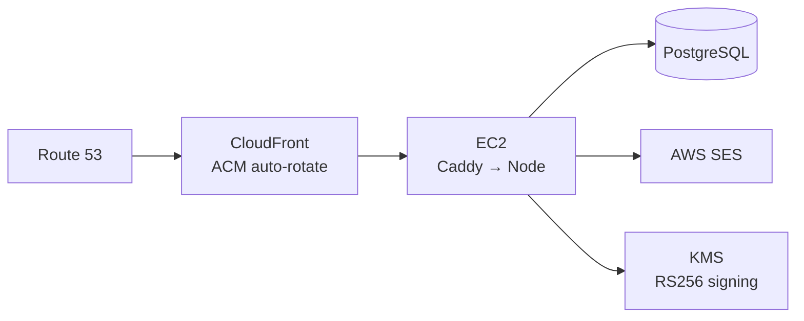
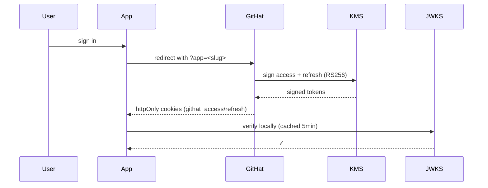

# NFTeria Inc.

**A holding org for a fleet of AWS-native apps that share one identity, one payments rail, and one deploy pattern.**

## Active subsidiaries

| App | Domain | Stack |
|---|---|---|
| **GitHat** | [githat.io](https://www.githat.io) | RS256/KMS identity provider for the fleet |
| **Sebastn** | sebastn.com | Stripe Connect payments-as-a-service |
| **ClickReserv** | [reserv.click](https://reserv.click) | Multi-tenant booking SaaS |
| **Quantl** | quantl.click | Quant signals + forecasting |
| **Colmado** | colmado.click | Commerce |

## Shared architecture

Every app uses the same edge pattern. CAA lockdown at each apex prevents non-AWS CAs from issuing certs. Auth is RS256/JWKS — no shared secrets between issuer and consumers.

## How auth flows

## Stack

`Next.js 16` · `React 19` · `TypeScript` · `Tailwind 4` · `Node 20` · `PostgreSQL` · `AWS (CloudFront, EC2, SES, KMS, Translate)` · `Stripe Connect` · `Foundry`
