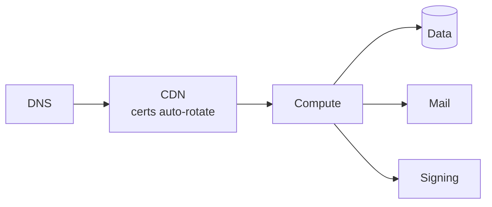
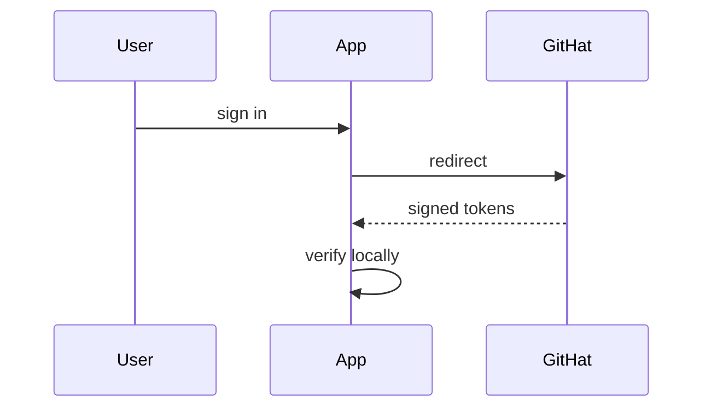

# NFTeria

### Your business, onchain.

Onchain payments, commerce, and credentials — non-custodial, USD-priced, no code.
**Powered by [Access0x1](https://github.com/Access0x1/Access0x1).**

[**nfteria.click**](https://nfteria.click) · live and verified on Base Sepolia + Arc · Arc mainnet this summer

## What you can do

- **Accept USD-priced crypto with one link** — customers never see gas, you never custody funds.
- **Full onchain commerce** — subscriptions, bookings, invoices, and gift cards, all settled on-chain.
- **Verified identity** — World ID + ENS checks on every payment.

Powered by **[Access0x1](https://github.com/Access0x1/Access0x1)** — the open, audited onchain payments layer (MIT · 859 tests · verified on Base Sepolia + Arc).

## The fleet

<!-- IDENTITY:fleet_table -->
| App | Domain | Role |
|---|---|---|
| **Access0x1** | [github.com/Access0x1/Access0x1](https://github.com/Access0x1/Access0x1) | Open-source onchain payments + identity rail |
| **NFTeria** | [nfteria.click](https://nfteria.click) | Onchain commerce built on Access0x1 |
<!-- /IDENTITY:fleet_table -->

## Shared edge

One edge pattern across every app. CAA lockdown at each apex.

## Auth shape

Verified locally. No shared secrets between issuer and consumers.
