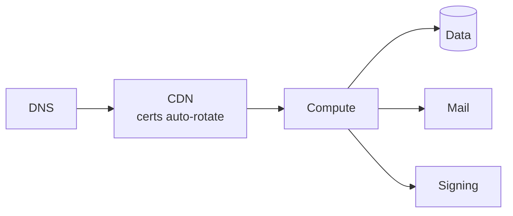
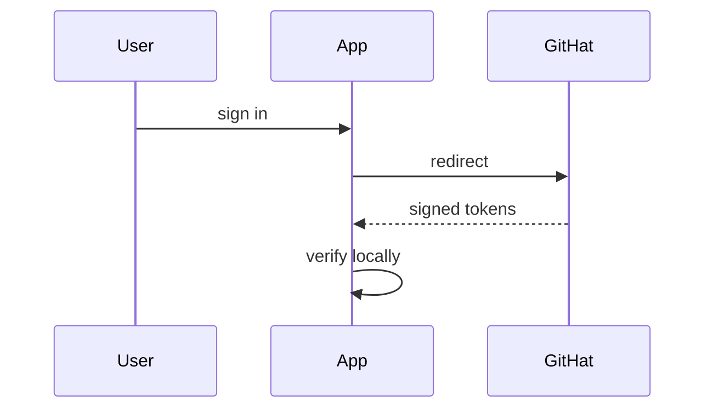

# NFTeria Inc.

**Holding org for a fleet of apps that share one identity layer, one payments rail, one deploy pattern.**

## Active subsidiaries

<!-- IDENTITY:fleet_table -->
| App | Domain | Role |
|---|---|---|
| **GitHat** | [githat.io](https://githat.io) | Identity layer for the fleet |
| **Sebastn** | [sebastn.com](https://sebastn.com) | Payments rail |
| **ClickReserv** | [reserv.click](https://reserv.click) | Multi-tenant booking SaaS |
| **Quantl** | [quantl.click](https://quantl.click) | Quant signals + forecasting |
| **Colmado** | [colmado.click](https://colmado.click) | Neighborhood commerce |
<!-- /IDENTITY:fleet_table -->

## Shared edge

One edge pattern across every app. CAA lockdown at each apex.

## Auth shape

Verified locally. No shared secrets between issuer and consumers.
